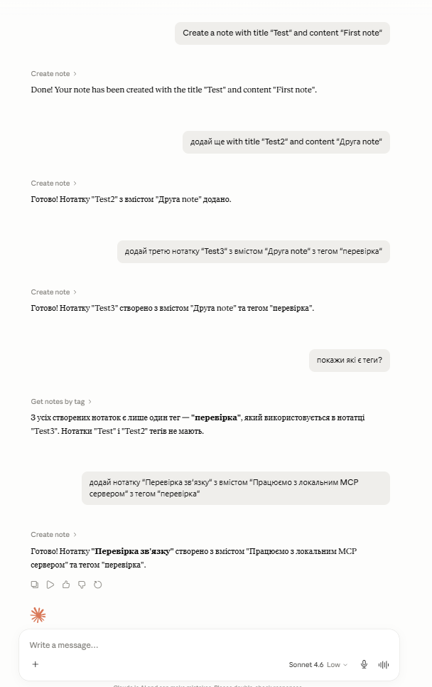
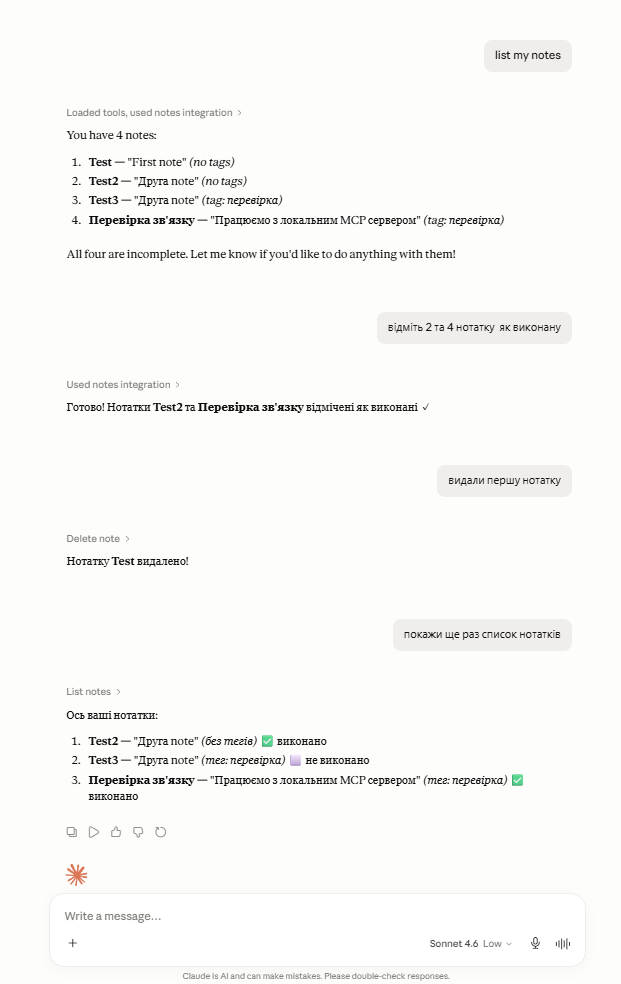
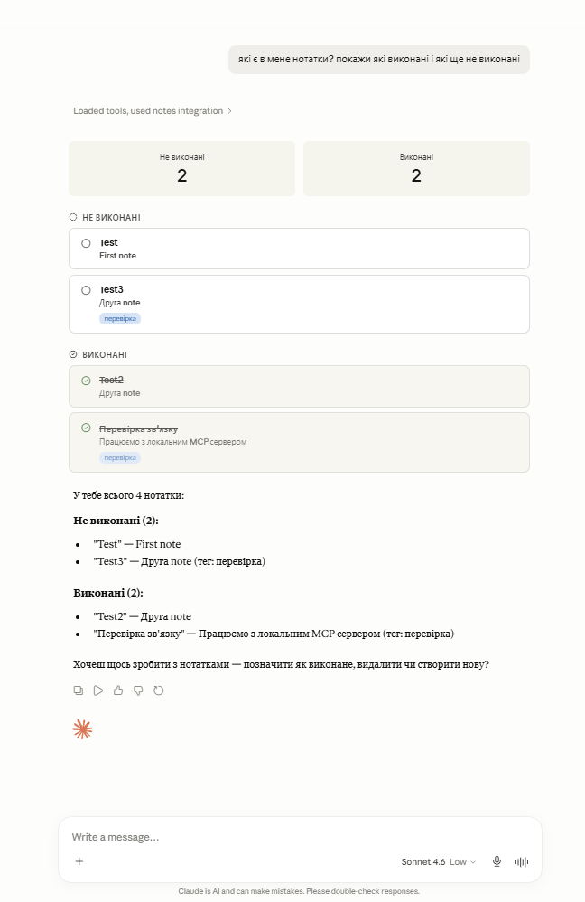
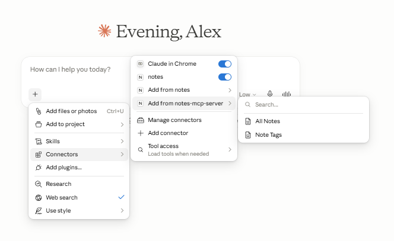

# Notes MCP Server

Локальний MCP-сервер для керування нотатками через Claude Desktop. Написаний на Python з використанням офіційного пакету `mcp` (FastMCP), транспорт — stdio.

---

## Середовище розробки

- **Залізо:** AMD Ryzen 7 6800H · 32 GB RAM · NVIDIA RTX 3050 Ti Laptop (4 GB VRAM)
- **ОС:** Windows 11 Pro
- **Python:** 3.14 (локально) · 3.11 (у venv для сервера)
- **Claude Desktop:** v1.11187.2 (MSIX, Windows Store)

---

## Структура проєкту

```
homework/
├── server.py                  # MCP-сервер
├── claude_desktop_config.json # Приклад конфігу для Claude Desktop
├── manifest.json              # Desktop Extension маніфест (додатковий спосіб)
├── notes.json                 # Сховище нотаток (створюється автоматично)
├── venv/                      # Віртуальне середовище Python
├── examples/
│   ├── Add_notes.png
│   ├── list_and_delete_and_completed.png
│   ├── list_complete_not_completed.png
│   └── claude_mcp_note.png
└── README.md
```

---

## Setup

### 1. Вимоги

- Python 3.10+
- Claude Desktop для Windows або macOS

### 2. Встановлення залежностей

```bash
python -m venv venv
venv\Scripts\activate
pip install mcp fastmcp anyio
```

### 3. Підключення до Claude Desktop

Єдиний надійний спосіб який працює — `fastmcp install`.

```bash
cd I:\path\to\homework
venv\Scripts\fastmcp install claude-desktop server.py
```

Ця команда автоматично знаходить правильний шлях до `claude_desktop_config.json` і записує туди конфіг сервера. Для MSIX-версії Claude Desktop (Windows Store) це критично важливо, бо конфіг знаходиться за нестандартним шляхом — не в `%APPDATA%\Roaming\Claude\`, а в:

```
C:\Users\<username>\AppData\Local\Packages\Claude_pzs8sxrjxfjjc\LocalCache\Roaming\Claude\claude_desktop_config.json
```

Після виконання команди повністю перезапусти Claude Desktop. У новому чаті в меню `+` → `Connectors` з'явиться `notes` з синім перемикачем — це означає що сервер підключений і готовий до роботи.

### Що записується в claude_desktop_config.json

```json
{
  "mcpServers": {
    "notes": {
      "command": "I:\\path\\to\\venv\\Scripts\\python.exe",
      "args": ["I:\\path\\to\\server.py"]
    }
  }
}
```

Приклад конфігу також є у файлі `claude_desktop_config.json` в репозиторії.

---

## Tools

| Tool | Аргументи | Опис |
|---|---|---|
| `create_note` | `title`*, `content`*, `tags`? | Створити нотатку з опціональними тегами |
| `list_notes` | `completed`? | Список нотаток, опціонально фільтр по статусу виконання |
| `search_notes` | `query`* | Пошук по назві, змісту та тегах |
| `get_notes_by_tag` | `tag`* | Нотатки з певним тегом |
| `complete_note` | `note_id`* | Позначити нотатку як виконану |
| `delete_note` | `note_id`* | Видалити нотатку |

`*` — обов'язковий аргумент, `?` — опціональний

### Структура нотатки

```json
{
  "id": "uuid",
  "title": "Назва",
  "content": "Зміст",
  "tags": ["тег1", "тег2"],
  "completed": false,
  "created_at": "2026-06-05T15:16:59.187182+00:00"
}
```

---

## Resources

| URI | Опис |
|---|---|
| `notes://all` | Всі нотатки у форматі JSON |
| `notes://tags` | Список унікальних тегів |

Resources доступні через `+` → `Connectors` → `Add from notes` → вибрати `All Notes` або `Note Tags`. Claude отримує їх як контекст для читання.

---

## Приклади діалогів

### Приклад 1 — Створення нотаток і перегляд тегів



```
Користувач: Create a note with title "Test" and content "First note"
Claude: [Create note] Done! Your note has been created.

Користувач: додай третю нотатку "Test3" з вмістом "Друга note" з тегом "перевірка"
Claude: [Create note] Готово! Нотатку "Test3" створено з тегом "перевірка".

Користувач: покажи які є теги?
Claude: [Get notes by tag] З усіх нотаток є лише один тег — "перевірка".
```

### Приклад 2 — Список нотаток, виконання та видалення



```
Користувач: list my notes
Claude: [List notes] You have 4 notes: Test, Test2, Test3, Перевірка зв'язку.

Користувач: відміть 2 та 4 нотатку як виконану
Claude: [Complete note x2] Нотатки Test2 та Перевірка зв'язку відмічені як виконані ✓

Користувач: видали першу нотатку
Claude: [Delete note] Нотатку Test видалено!

Користувач: покажи ще раз список нотаток
Claude: [List notes] Залишилось 3 нотатки. Test2 та Перевірка зв'язку — виконані.
```

### Приклад 3 — Фільтр по статусу виконання



```
Користувач: які є в мене нотатки? покажи які виконані і які ще не виконані
Claude: [List notes] У тебе всього 4 нотатки:
  Не виконані (2): Test, Test3
  Виконані (2): Test2, Перевірка зв'язку
```

### Приклад 4 — Підключений сервер в меню Claude Desktop



Скріншот показує що сервер `notes` успішно підключений — синій перемикач активний в меню `+` → `Connectors`. В підменю "Add from notes-mcp-server" видно два resources: `All Notes` і `Note Tags`. Tools доступні автоматично після підключення сервера.

---

## Проблеми які виникли і як їх вирішили

### Проблема 1: Ручний конфіг не давав результату

Перша спроба — записати `claude_desktop_config.json` вручну в `%APPDATA%\Roaming\Claude\`. Сервер з'явився в Settings → Developer зі статусом "running", але tools в чаті не з'являлись. Claude не викликав жодного tool і відповідав що не має доступу до нотаток.

Причина: MSIX-версія Claude Desktop читає конфіг з іншого місця — `AppData\Local\Packages\Claude_pzs8sxrjxfjjc\LocalCache\Roaming\Claude\`. Після того як конфіг був скопійований туди, сервер почав запускатись — але tools все одно не викликались.

### Проблема 2: Desktop Extension (manifest.json) — "no tools available"

Друга спроба — встановити сервер як Desktop Extension через Settings → Extensions → Advanced → Install Unpacked Extension з файлом `manifest.json`. Сервер з'явився в Connectors як "notes-mcp-server", але в деталях показував "This connector has no tools available" і "Tool permissions: Choose when Claude is allowed to use these tools" — без жодного tool у списку.

Причина: формат `manifest.json` для Desktop Extensions не підтримує динамічну реєстрацію tools з MCP-сервера в UI. Tools технічно передавались через MCP-протокол, але Claude Desktop не відображав їх як доступні для виклику в чаті.

### Проблема 3: Connector Discovery перехоплював запити

Поки була увімкнена функція "Connector Discovery" в Settings → Capabilities, Claude при будь-якому запиті про нотатки пропонував підключити зовнішні сервіси (Mem, Goodnotes) замість використання локального сервера.

Рішення: вимкнути Connector Discovery в Settings → Capabilities.

### Рішення яке спрацювало: fastmcp install

```bash
venv\Scripts\fastmcp install claude-desktop server.py
```

Ця команда знайшла правильний шлях до конфігу, записала коректний запис і зареєструвала сервер так, що Claude Desktop почав передавати tools в контекст чату. Після повного перезапуску Claude Desktop в меню `+` → `Connectors` з'явився `notes` з синім перемикачем, і tools почали викликатись.

---

## Known Limitations

### 1. Повільний старт сервера при першому виклику

Перший виклик tool може займати 10–30 секунд. Claude Desktop показує "Taking longer than usual. Trying again shortly (attempt N)". Це нормально — сервер запускається як subprocess при першому зверненні. Наступні виклики в тому ж чаті працюють швидко.

### 2. MSIX-версія Claude Desktop і нестандартний шлях до конфігу

Claude Desktop з Windows Store (MSIX) зберігає конфіг за нестандартним шляхом (`LocalCache\Roaming\Claude`). Ручне редагування `%APPDATA%\Roaming\Claude\claude_desktop_config.json` не має ефекту — читається інший файл. Через це спроби підключити сервер вручну через JSON конфіг не давали результату поки не був використаний `fastmcp install`, який знаходить правильний шлях автоматично.

### 3. Дозволи на виклик tools

При першому виклику кожного tool Claude Desktop запитує дозвіл користувача. Після підтвердження в поточній сесії більше не питає.

### 4. Відсутність автентифікації

Сервер не має захисту — будь-який процес на локальній машині може читати і змінювати `notes.json`. Для продакшн-використання потрібно додати контроль доступу.

---

## Проблеми, які потрібно вирішити для вдосконалення

### 1. Відсутність фільтрації по даті

Поле `created_at` зберігається в кожній нотатці, але окремого tool для пошуку по даті не реалізовано. Можна додати tool `get_notes_by_date(date: str)` як розширення.

### 2. Один файл зберігання

Всі нотатки в одному `notes.json`. При великій кількості нотаток (1000+) можливе уповільнення через повне перезавантаження файлу при кожній операції.
